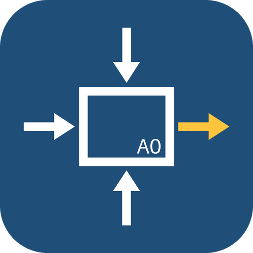
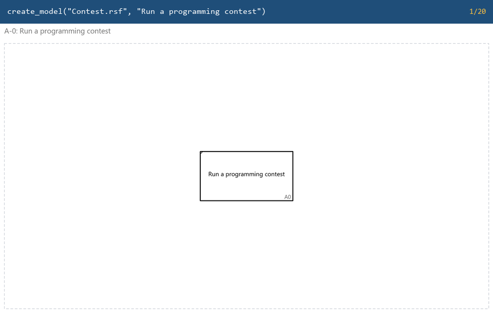
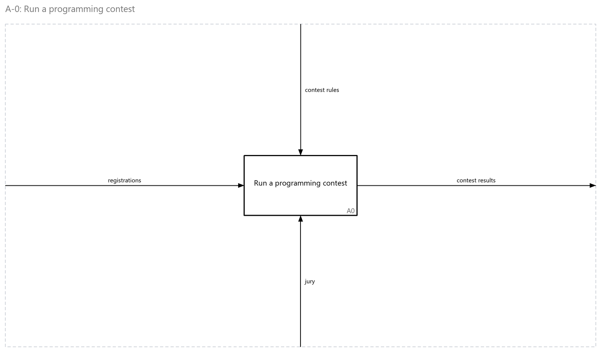
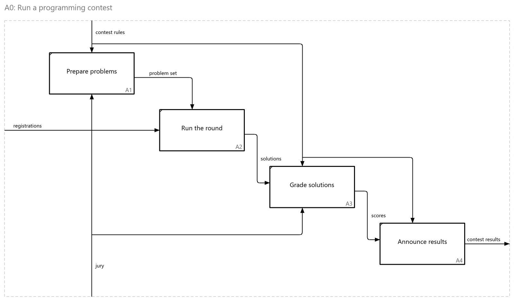
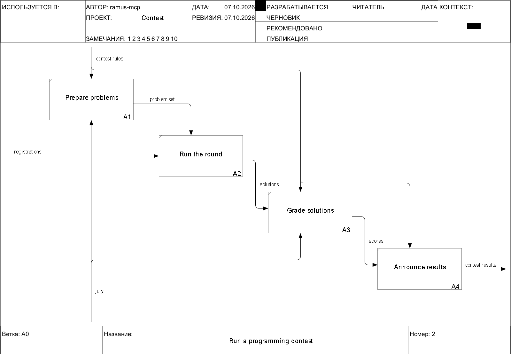

<div align="center">



# ramus-mcp

**Claude's eyes and hands for Ramus IDEF0 models**

[](https://github.com/byMERCY/ramus-mcp/actions/workflows/tests.yml)
[](LICENSE)
[](https://modelcontextprotocol.io)
[](#install-in-claude-desktop)
[](pyproject.toml)

**English** · [Русский](README.ru.md)

</div>

ramus-mcp lets Claude — or any MCP client — work with models made in
[Ramus](https://github.com/Vitaliy-Yakovchuk/ramus), the IDEF0 business-process modelling tool. It
opens a `.rsf` file, reads the activity tree and every arrow, and **sees** each diagram as a
picture. It **checks** the model against the rules of IDEF0, **changes** it with boxes and arrows
placed and routed the IDEF0 way, or **builds a new model from nothing** — and saves a `.rsf`
that Ramus opens.

<p align="center">
  
  <br><sub>A model built from nothing — every frame is one tool call, drawn by the server itself.</sub>
</p>

## What it does

| | |
|---|---|
| **Eyes** | Reads the activity tree, each sheet's boxes and arrows with their ICOM roles, and renders any sheet as a PNG that Claude looks at. Files from Ramus 2.x and 3.x. |
| **Rules** | `check_model` checks IDEF0: a control and an output on every activity, arrows by the right sides, ICOM balance between levels, 3–6 boxes on a sheet, verbs for activities and nouns for arrows. Every finding comes with the call that fixes it, and every edit reports what it broke or settled. |
| **Hands** | Creates models, adds, moves and deletes boxes, draws arrows — box to box, to and from the frame, forks and joins — with an orthogonal router that keeps clear of boxes and other arrows, joins arrows across levels, tidies a tangled sheet, and saves. |

<table>
  <tr>
    <td width="50%"></td>
    <td width="50%"></td>
  </tr>
  <tr>
    <td align="center"><sub>Context diagram A-0</sub></td>
    <td align="center"><sub>Its decomposition A0 — <code>check_model</code>: no errors, no warnings</sub></td>
  </tr>
</table>

## Install in Claude Desktop

1. Download `ramus-mcp-<version>.mcpb` from the [latest release](../../releases/latest).
2. Double-click it — or in Claude Desktop open **Settings → Extensions → Advanced settings →
   Install Extension…** and pick the file.
3. Choose the folder you keep your models in.

Claude Desktop sets up Python and the dependencies itself; the first start takes a minute. Then
just ask:

- *"Which Ramus models do I have?"*
- *"Open the hiking model and show me diagram A0."*
- *"Check the model against IDEF0 and fix what you can."*
- *"Create a model 'Run a programming contest': a context diagram and a decomposition into four
  activities."*
- *"Tidy up the arrows on A2 and save the model as a copy."*

Changes stay in memory until you ask Claude to save. Saving over the opened file first copies
it to `<name>.backup.rsf`; close the model in Ramus before that.

## It opens in Ramus

The server writes the file format itself, the way Ramus does: a table it rewrites is byte for
byte what Ramus would write, and each kind of change was checked by opening the result in the
Ramus engine. Here is the model above, as Ramus draws it:

<p align="center"></p>

## Other MCP clients

The server speaks MCP over stdio. With [uv](https://docs.astral.sh/uv/):

```bash
uv run --directory /path/to/ramus-mcp src/server.py
```

Claude Code: `claude mcp add ramus -- uv run --directory /path/to/ramus-mcp src/server.py`.
A client configured by JSON:

```json
{
  "mcpServers": {
    "ramus": {
      "command": "uv",
      "args": ["run", "--directory", "/path/to/ramus-mcp", "src/server.py"],
      "env": { "RAMUS_MODELS_DIR": "/path/to/your/models" }
    }
  }
}
```

Without uv: `python -m venv .venv`, `pip install -r requirements.txt`, then run `src/server.py`
with that Python. `RAMUS_MODELS_DIR` (optional) is where `list_models` looks and relative paths
start.

## Tools

A sheet is named by the activity it decomposes — `"A-0"` is the context diagram, `"A0"` its
decomposition, then `"A1"`, `"A12"`… — and an activity by its number or id.

<details>
<summary><b>23 tools</b> — click to open</summary>

| Tool | What it does |
|---|---|
| `list_models(folder?)` | The `.rsf` files in the models folder (or another), newest first |
| `open_model(path)` · `current_model()` | Open a model; say which one is open |
| `create_model(path, activity, author?, project?)` | A new model whose context diagram holds the top activity A0 |
| `list_diagrams()` · `get_function_tree()` | The sheets; the activity tree with IDEF0 numbers |
| `get_diagram(node, include_routes?)` | One sheet as data: boxes, flows with their ICOM roles, tunnels, ids for editing |
| `render_diagram(node)` · `render_diagram_svg_text(node)` | One sheet as a PNG, or as SVG |
| `check_model(sheet?)` | IDEF0 findings — errors and warnings — each with the call that fixes it |
| `check_layout(sheet)` | How well a sheet is drawn: crossings, detours, arrow ends in corners, feedback the wrong way round, names astray — a score and the faults behind it |
| `rename_activity` · `rename_flow` | Rename a box; rename what an arrow carries, on every level |
| `add_activity(parent, name, …)` | Add a box; it takes the next number and is placed down the IDEF0 diagonal — while no arrow touches the boxes, all of them are spread again to fit the page |
| `add_arrow(sheet, source, target, name?)` | Draw an arrow: box → box, frame → box, box → frame, a fork off an arrow or a join into one; joined to the same arrow on the other level when it is there |
| `move_activity(activity, …)` | Move or resize a box; its arrows follow |
| `delete_activity` · `delete_arrow` | Delete a box with its arrows; delete an arrow segment — as Ramus does |
| `join_levels(first, second)` | Tie an arrow to its continuation on the level below |
| `tidy_sheet(sheet)` · `tidy_labels(sheet)` | Lay a sheet's arrows out again — forks and joins redrawn as one line with branches — keeping only what reads better; move only the names in the way |
| `layout_sheet(sheet)` | Lay a sheet out afresh: boxes down the diagonal sized to the page, every arrow drawn again; kept only if it reads better |
| `save_model(path?)` | Write the changes — over the file (with a backup) or to a copy |

</details>

## Limits

- Arrows are drawn and rerouted in files saved by Ramus 3.x. A Ramus 2.x file keeps its routes in
  a binary form this does not write yet: open and save it once in Ramus 3.
- DFD shapes are drawn as IDEF0 boxes, and a sheet is one page.
- A tunnel in square brackets looks like a forgotten arrow in the file; `check_model` reports it
  as a warning that is right only if the tunnel was meant.

## Development

```bash
python -m unittest discover -s tests     # ~250 tests, a few seconds
python tools/build_mcpb.py               # the Claude Desktop extension, into dist/
python tools/make_demo.py                # the pictures in this README
```

Most tests build a small model on the fly. `tools/ramus_validate.py` opens a file in a Ramus
engine to check what was written. Pushing a tag `v*` builds the extension and attaches it to a
GitHub release.

The server contains no Ramus code: it works on the `.rsf` file format alone — a ZIP of XML table
dumps — so it needs neither Ramus nor Java.

## License

[MIT](LICENSE) © byMERCY
