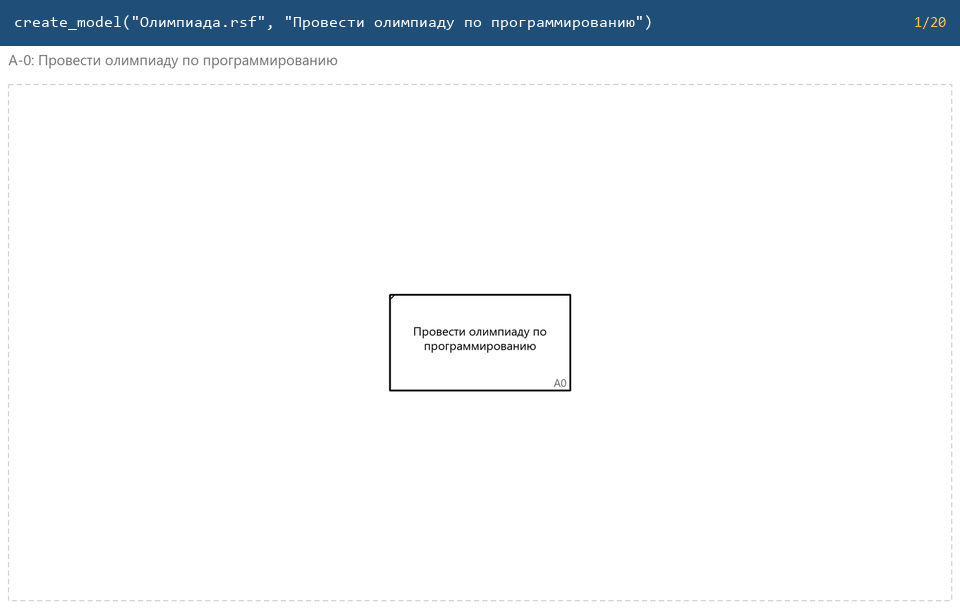
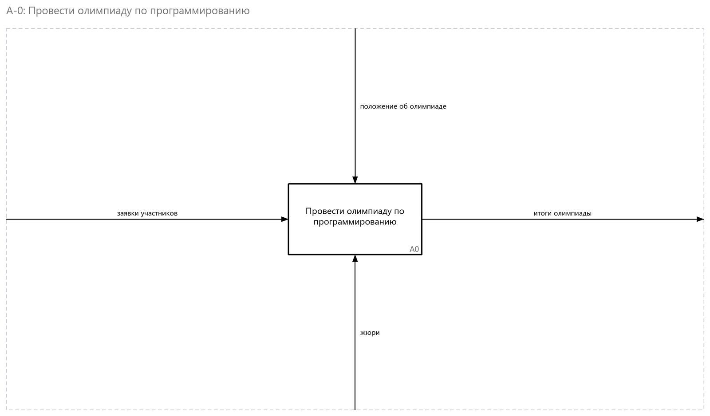
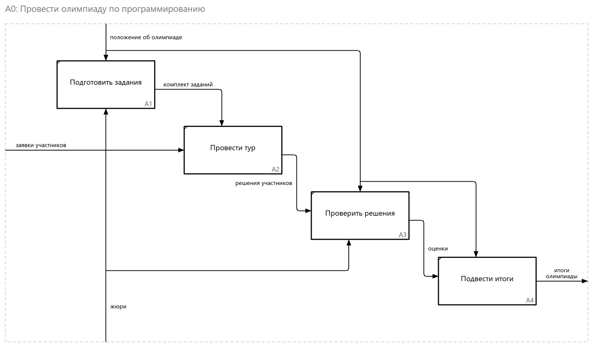
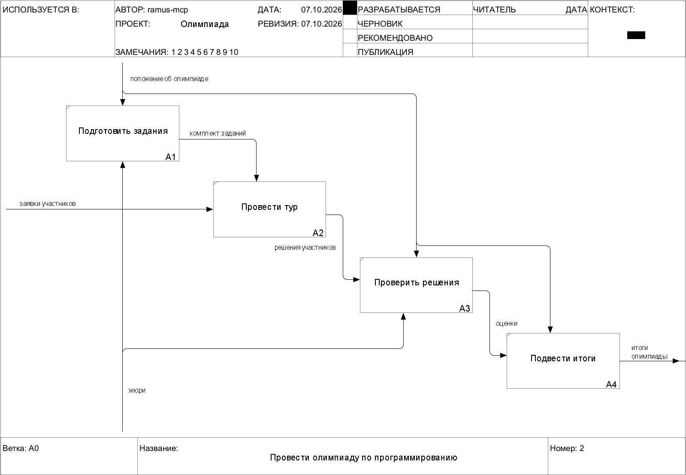

<div align="center">


# ramus-mcp

**Глаза и руки Клода для моделей IDEF0 в Ramus**

[](https://github.com/byMERCY/ramus-mcp/actions/workflows/tests.yml)
[](LICENSE)
[](https://modelcontextprotocol.io)
[](#установка-в-claude-desktop)
[](pyproject.toml)

[English](README.md) · **Русский**

</div>

ramus-mcp даёт Клоду — или любому MCP-клиенту — работать с моделями
[Ramus](https://github.com/Vitaliy-Yakovchuk/ramus), программы для моделирования бизнес-процессов
в IDEF0. Он открывает файл `.rsf`, читает дерево работ и все стрелки и **видит** каждую диаграмму
картинкой. **Проверяет** модель по правилам IDEF0, **правит** её — блоки и стрелки ставятся и
прокладываются по канонам IDEF0 — или **строит новую модель с нуля** и сохраняет `.rsf`, который
открывает Ramus.

<p align="center">
  
  <br><sub>Модель строится с нуля: каждый кадр — один вызов инструмента, нарисованный самим сервером.</sub>
</p>

## Что умеет

| | |
|---|---|
| **Глаза** | Читает дерево работ, блоки и стрелки каждого листа с их ролями ICOM и рисует любой лист в PNG, который Клод видит, — IDEF0, а также диаграммы потоков данных DFD и DFDS: процессы, внешние сущности, хранилища и роли нарисованы так, как их рисует Ramus. Файлы Ramus 2.x и 3.x. |
| **Правила** | `check_model` проверяет IDEF0: у каждой работы есть управление и выход, стрелки входят и выходят нужными сторонами, баланс ICOM между уровнями, 3–6 блоков на листе, работы названы глаголами, стрелки — существительными; на DFD — что каждый процесс что-то принимает и что-то выдаёт, а данные ходят только через процессы. К каждой находке приложен вызов, который её исправляет, а каждая правка сообщает, что сломала и что починила. `check_layout` оценивает, насколько аккуратно нарисован лист. |
| **Руки** | Создаёт модели в IDEF0, DFD или DFDS, добавляет, двигает и удаляет блоки, рисует стрелки — от блока к блоку, с рамки и на рамку, развилки и слияния — ортогональным трассировщиком, который обходит блоки и другие стрелки, связывает стрелки между уровнями, раскладывает лист по диагонали (общие управления и механизмы — одной линией с отводами), приводит в порядок запутанный лист и сохраняет. |

<table>
  <tr>
    <td width="50%"></td>
    <td width="50%"></td>
  </tr>
  <tr>
    <td align="center"><sub>Контекстная диаграмма A-0</sub></td>
    <td align="center"><sub>Её декомпозиция A0 — <code>check_model</code>: ни ошибок, ни предупреждений</sub></td>
  </tr>
</table>

## Установка в Claude Desktop

1. Скачайте `ramus-mcp-<версия>.mcpb` из [последнего релиза](../../releases/latest).
2. Откройте его двойным кликом — или в Claude Desktop: **Settings → Extensions → Advanced settings
   → Install Extension…** и выберите файл.
3. Укажите папку, где лежат ваши модели.

Python и зависимости Claude Desktop ставит сам, первый запуск занимает около минуты. Дальше
просто пишите в чат:

- «Какие у меня есть модели Ramus?»
- «Открой модель «поход» и покажи диаграмму A0.»
- «Проверь модель по правилам IDEF0 и исправь, что можно.»
- «Создай модель «Провести олимпиаду по программированию»: контекстная диаграмма и декомпозиция
  на четыре работы.»
- «Наведи порядок со стрелками на A2 и сохрани модель копией.»

Правки хранятся в памяти, пока вы не попросите сохранить. При сохранении поверх открытого файла
он сначала копируется в `<имя>.backup.rsf`; перед этим закройте модель в Ramus.

## Открывается в Ramus

Сервер сам пишет формат файла — так же, как Ramus: переписанная таблица байт в байт совпадает с
тем, что записал бы Ramus, а каждый вид правки проверен открытием результата в движке Ramus. Вот
модель сверху так, как её рисует Ramus:

<p align="center"></p>

## Другие MCP-клиенты

Сервер работает по MCP через stdio. С [uv](https://docs.astral.sh/uv/):

```bash
uv run --directory /path/to/ramus-mcp src/server.py
```

Claude Code: `claude mcp add ramus -- uv run --directory /path/to/ramus-mcp src/server.py`.
Клиент с настройкой в JSON:

```json
{
  "mcpServers": {
    "ramus": {
      "command": "uv",
      "args": ["run", "--directory", "/path/to/ramus-mcp", "src/server.py"],
      "env": { "RAMUS_MODELS_DIR": "/path/to/your/models" }
    }
  }
}
```

Без uv: `python -m venv .venv`, `pip install -r requirements.txt` и запуск `src/server.py` этим
Python. `RAMUS_MODELS_DIR` (необязательно) — где `list_models` ищет модели и откуда считаются
относительные пути.

## Инструменты

Лист называется по работе, которую он раскрывает: `"A-0"` — контекстная диаграмма, `"A0"` — её
декомпозиция, дальше `"A1"`, `"A12"`…; работа — по номеру или id.

<details>
<summary><b>24 инструмента</b> — нажмите, чтобы раскрыть</summary>

| Инструмент | Что делает |
|---|---|
| `list_models(folder?)` | Файлы `.rsf` в папке моделей (или другой), сначала новые |
| `open_model(path)` · `current_model()` | Открыть модель; сказать, какая открыта |
| `create_model(path, activity, author?, project?, notation?)` | Новая модель — IDEF0, DFD или DFDS: контекстная диаграмма с главной работой A0 |
| `list_diagrams()` · `get_function_tree()` | Листы; дерево работ с номерами IDEF0 |
| `get_diagram(node, include_routes?)` | Лист как данные: блоки, потоки с ролями ICOM, тоннели, id для правок |
| `render_diagram(node, form?)` · `render_diagram_svg_text(node, form?)` | Лист картинкой PNG или в SVG — с `form` в бланке IDEF0: шапка (автор, проект, даты, статус, контекст) и подвал (узел, название, номер) |
| `export_diagram(path, node?, form?, scale?)` | Записать один лист или все в файлы PNG или SVG, в бланке — сразу в отчёт |
| `check_model(sheet?)` | Замечания по IDEF0 — ошибки и предупреждения — с вызовом-исправлением к каждому |
| `check_layout(sheet)` | Насколько хорошо нарисован лист: пересечения, обходы, концы стрелок в углах, обратные связи не с той стороны, потерянные подписи — оценка и что за ней |
| `rename_activity` · `rename_flow` | Переименовать блок; переименовать то, что несёт стрелка, на всех уровнях |
| `add_activity(parent, name, …)` | Добавить блок: он получает следующий номер и встаёт по диагонали IDEF0 — пока стрелки не касаются блоков, все они заново расставляются по размеру листа |
| `add_arrow(sheet, source, target, name?)` | Нарисовать стрелку: блок → блок, рамка → блок, блок → рамка, развилка от стрелки или слияние в неё; связывается с той же стрелкой на другом уровне, если она там есть |
| `move_activity(activity, …)` | Передвинуть или изменить размер блока; стрелки идут за ним |
| `delete_activity` · `delete_arrow` | Удалить блок со стрелками; удалить отрезок стрелки — как это делает Ramus |
| `join_levels(first, second)` | Связать стрелку с её продолжением уровнем ниже |
| `tidy_sheet(sheet)` · `tidy_labels(sheet)` | Заново разложить стрелки листа — развилки и слияния перерисовываются одной линией с ответвлениями — оставив только то, что читается лучше; передвинуть только мешающие подписи |
| `layout_sheet(sheet)` | Разложить лист заново: блоки по диагонали под размер листа, все стрелки перерисованы; остаётся, только если читается лучше |
| `save_model(path?)` | Записать правки — поверх файла (с резервной копией) или в копию |

</details>

## Ограничения

- Стрелки рисуются и перекладываются в файлах, сохранённых Ramus 3.x. Файл Ramus 2.x хранит
  маршруты в двоичном виде, который пока не пишется: откройте и сохраните его один раз в Ramus 3.
- Лист — одна страница. На диаграммах потоков данных процессы встают по диагонали, внешние сущности и хранилища — рядом; `layout_sheet` перерисовывает их потоки, но блоки оставляет на месте.
- Тоннель в квадратных скобках в файле неотличим от забытой стрелки; `check_model` сообщает о нём
  предупреждением — оно верно, только если тоннель задуман.

## Разработка

```bash
python -m unittest discover -s tests     # ~250 тестов, несколько секунд
python tools/build_mcpb.py               # расширение Claude Desktop, в dist/
python tools/make_demo.py                # картинки этого README
```

Большинство тестов собирают маленькую модель на лету. `tools/ramus_validate.py` открывает файл в
движке Ramus, чтобы проверить записанное. Пуш тега `v*` собирает расширение и прикладывает его к
релизу на GitHub.

В сервере нет кода Ramus: он работает только с форматом файла `.rsf` — ZIP с XML-дампами таблиц —
поэтому ему не нужны ни Ramus, ни Java.

## Лицензия

[MIT](LICENSE) © byMERCY
